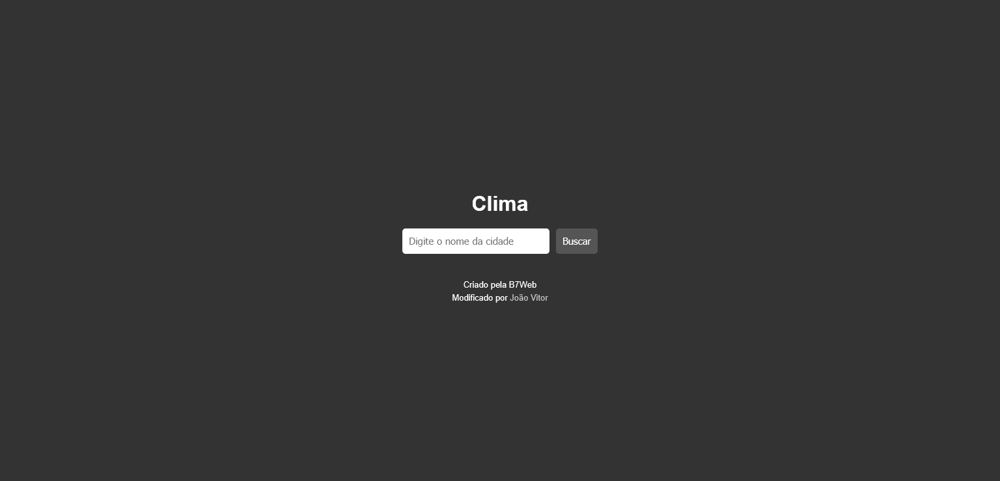
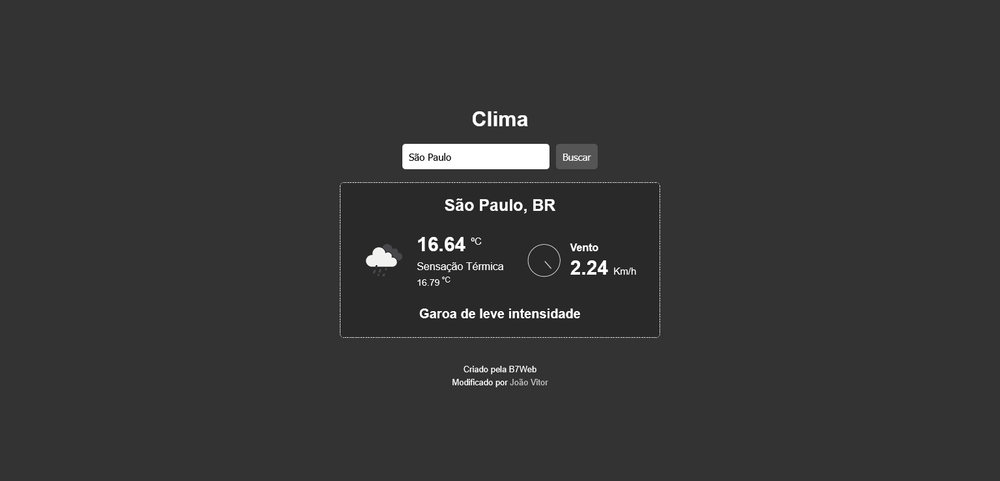

<h1 align="center">
    Aplicação de verificação de clima
</h1>

Projeto desenvolvido em uma aula do curso da B7Web, com algumas modificações, como alteração do layout, e adição de uma nova funcionalidade que mostra, além da temperatura e do vento, o clima da cidade

# Tabela de conteúdos

* [Demonstração do site](#gear-Demonstração-do-site)
* [Tecnologias](#computer-Tecnologias)
* [Licensa](#page_facing_up-Licensa)

# :gear: Demonstração do site

Acesse o site aqui: 

## Layout

    
    

# :computer: Tecnologias

Este projeto foi desenvolvido utilizando as seguintes tecnologias:

* HTML5
* CSS3
* Javascript
* [OpenWeatherMap (API)](https://openweathermap.org/)

# :page_facing_up: Licensa

O layout inicial deste projeto foi desenvolvido em uma aula do curso da [B7Web](https://b7web.com.br/fullstack/), neste projeto foram feitas algumas modificações.

Codado por [João Vitor](https://github.com/JVUser01) :rocket:. Esse projeto está sob a [licença MIT](LICENSE.txt).